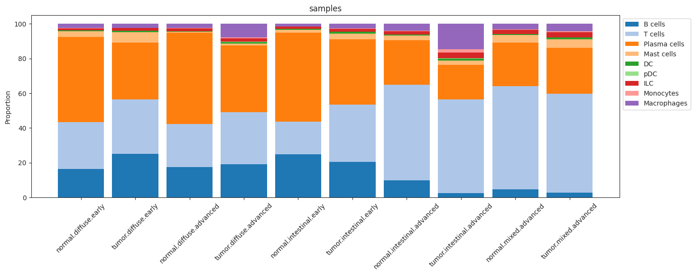
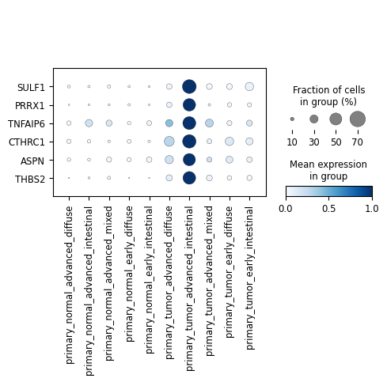
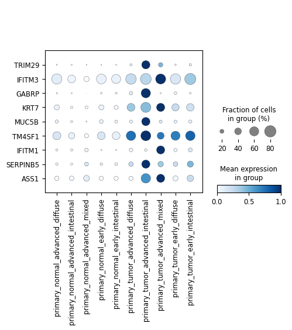

# **Meta-analysis of Single-cell RNA Sequencing (scRNA-seq) Data in Gastric Adenocarcinoma**

Gastric cancer, predominantly adenocarcinoma, is one of the most prevalent and deadly cancers worldwide. It accounts for over 95% of gastric cancer cases, with high mortality rates due to late-stage diagnoses and the aggressive nature of the disease. The Lauren classification divides gastric adenocarcinomas into three types: intestinal (well-differentiated), diffuse (poorly differentiated), and mixed, with the diffuse type being more aggressive and associated with worse outcomes due to its high heterogeneity and invasive behavior. Early detection is crucial for improving survival, but this remains challenging due to a lack of specific symptoms in the early stages and limited screening, especially in low-incidence regions. Identifying sensitive biomarkers for early diagnosis is critical to reducing the mortality associated with this disease. (reviewed in [Sexton *et al.* 2020](http://doi.org/10.1007/s10555-020-09925-3))

In this project, samples from three different datasets ([Jiang *et al.* 2022](https://doi.org/10.1002/ctm2.730), [Kim *et al.* 2022](https://doi.org/10.1038/s41698-022-00251-1), [Kumar *et al.* 2022](http://doi.org/10.1158/2159-8290.CD-21-0683)), representing patients with gastric adenocarcinoma at various stages and subtypes (intestinal, diffuse, and mixed), were analyzed together in a meta-analysis. Each sample was paired, with both tumor and adjacent normal tissue collected from the same patient. The aim of this analysis was to infer common molecular patterns and identify potential biomarkers across these patient groups. (For more detailed information about each sample, see *metadata.csv*.)

Methods:
- 
* Single-cell RNA sequencing data were processed using a custom Python script `qc_norm.py` integrating `scanpy`, `scipy`, and R libraries (`celda`, `scDblFinder`). Raw count matrices were imported from public databases (see *metadata.csv*). **Quality control** involved filtering based on cell and gene counts, mitochondrial gene expression, and detecting doublets using `scDblFinder` ([Germain *et al.* 2021](http://doi.org/10.12688/f1000research.73600.2)). Ambient RNA contamination was addressed using the DecontX algorithm ([Yang *et al.* 2020](https://doi.org/10.1186/s13059-020-1950-6,)). Finalized data were saved as AnnData objects in `.h5ad` format for further analysis. 

* To address batch effects, **data integration** was performed using the `scVI` (single-cell Variational Inference) method ([Gayoso *et al.* 2022](http://doi.org/10.1038/s41587-021-01206-w)). This approach utilizes a conditional variational autoencoder with a subset of highly variable genes, selected in a batch-aware manner using `scanpy`. (see notebook *NB1_integration.ipynb*) 
* **Celltype annotation** was done using both manual and automated approaches. Manual annotation involved checking known marker gene expression and identifying highly expressed genes within clusters to match cell types. Automated annotation was performed using `CellTypist` ([Conde *et al.*, 2022](http://doi.org/10.1126/science.abl5197)). (see notebook *NB2_annotation.ipynb*)

* Cell-type proportions were evaluated in a **compositional analysis** using the `scCODA` model ([Büttner *et al.* 2021]( https://doi.org/10.1038/s41467-021-27150-6)), a Bayesian approach that accounts for uncertainty and negative correlation bias in cell-type composition. **Differential expression analysis** was conducted at both the sample and cell levels. At the sample level, expression data was aggregated into pseudobulks and analyzed with `edgeR` ([Robinson *et al.*, 2010](https://doi.org/10.1093/bioinformatics/btp616)). For cell-level analysis, the `scVI` model’s differential_expression() function ([Gayoso *et al.*, 2022](http://doi.org/10.1038/s41587-021-01206-w)) was used, incorporating cell-specific variability and technical noise into the gene expression model. (see notebook *NB3_compositional_and_DE_analyses.ipynb*)

Results:
-

**Compositional Analysis - Changes in Immune cells in the Tumor Microenvironement (TME):**

The analysis revealed distinct immune cell composition differences across tumor types within the tumor microenvironment (TME). Diffuse-type tumors had higher levels of B cells and plasma cells compared to intestinal-type tumors, while mixed-type tumors showed increased T cells and mast cells relative to diffuse-type tumors. Additionally, macrophages were more abundant in intestinal-type tumors than in mixed-type tumors. In advanced stages, both diffuse- and intestinal-type tumors exhibited increased macrophage presence. Advanced intestinal-type tumors also showed a rise in monocytes, with a decrease in B cells and plasma cells, whereas diffuse-type tumors had fewer mast cells in advanced stages. (see notebook *NB3_compositional_and_DE_analyses.ipynb*)

*Figure 1. Differences in immune cell composition across sample types.*

**Differential Gene Expression Analysis - Changes in Gene Expression between Tumor and Normal Samples:**

Differential gene expression analysis between tumor and corresponding normal samples, using both pseudobulk and single-cell methods, revealed overlapping DEGs, adding confidence to the results. Fibroblasts and mucous cells were selected for their high representation across samples, allowing for a robust analysis of tumor-specific changes.
In advanced intestinal tumor samples, fibroblasts showed a distinct expression profile with notable increases in genes such as **SULF1**, **PRRX1**, and **ASPN**, which are known to drive tumor growth, metastasis, and fibrosis ([Hur et al., 2021](https://doi.org/10.1002/path.4055); [Fang et al., 2024](https://doi.org/10.1038/s41420-024-01882-y); [Lee et al., 2022](https://doi.org/10.1038/s41467-022-30484-4); [Tanaka, 2022](https://doi.org/10.1111/pin.13211); [Dong et al., 2022](https://doi.org/10.3389/fbioe.2022.1025546)). This underscores the role of cancer-associated fibroblasts in supporting tumor progression.
In early-stage tumors, **TM4SF1** was consistently expressed in mucous cells, suggesting its potential as an early biomarker for gastric cancer. Its role in cell proliferation and migration highlights **TM4SF1** as a promising candidate for early detection and therapeutic intervention ([Rahim et al., 2023](https://doi.org/10.3390/ph16010110); [Wei et al., 2022](https://doi.org/10.1016/j.mrfmmm.2022.111802)). (see notebook *NB3_compositional_and_DE_analyses.ipynb*)

  

    
    
<em>Figure 2. Overlapping differentially expressed genes (DEGs) identified between tumor and normal samples in fibroblasts using both pseudobulk and single-cell specific methods.</em>

  

  

    
    
<em>Figure 3. Overlapping differentially expressed genes (DEGs) identified between tumor and normal samples in gastric mucous cells using both pseudobulk and single-cell specific methods.</em>

  

---

For more details, refer to the following scripts and notebooks:

- **qc_norm.py**: Preprocessing, quality control, and normalization.
- **NB1_integration.ipynb**: Data integration to alleviate batch effects.
- **NB2_annotation.ipynb**: Cell type annotation.
- **NB3_compositional_and_DE_analyses.ipynb**: Compositional analysis and differential expression analysis (DEA).

Notebooks were run in the [Google Colab](https://colab.research.google.com/) environment.

